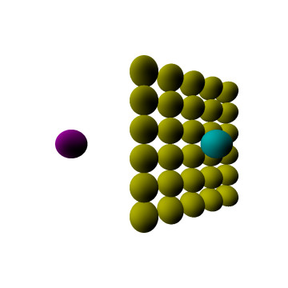

# RayTracing
 ### Simple ray tracing algorithm for direct illumination of spheres.  
 (ECE 6360 GPU and Heterogeneous Programming course assignment)

 

* For a given list of sphere and light coordinates (txt file), renders and saves the ray-traced image as Targa (TGA) file.
* Parallelized using C++ std::thread library
* To open TGA images I recommend installing the [Honeyview](https://en.bandisoft.com/honeyview/) software.
* No additional libraries required
* sphere.txt order: `x, y, z, r, B, G, R` 
  - RGB is flipped to align with the TARGA file format 
* light.txt order: `x, y, z, B, G, R`  
  - This code is written for white light only (RGB = (1,1,1))
 
 </td>
